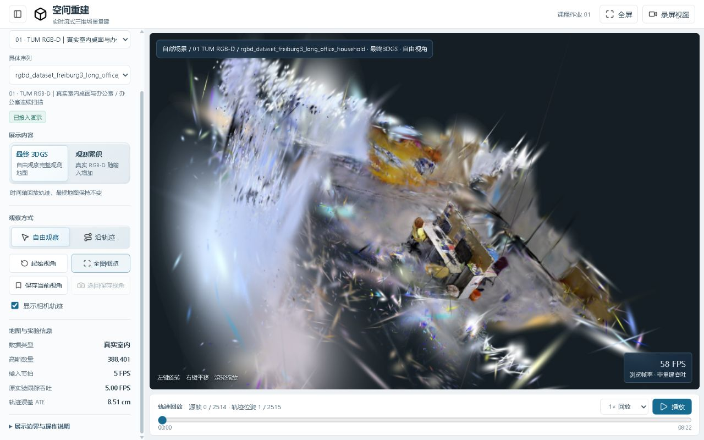
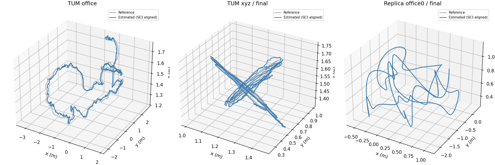

# 3DGS Reconstruction · RGB-D 三维重建与交互展示

基于 **GS-ICP-SLAM** 的课程项目与协作仓库：从 RGB-D 序列估计相机轨迹、构建 3D Gaussian 地图，再用浏览器自由查看。仓库同时保留固定预算实验、场景适配和失败诊断，方便继续开发与核验。

**建议先运行网站，再准备 GPU 算法环境。** 网站可在 Windows 上查看已有结果；重新重建需要 NVIDIA GPU、CUDA 与 Linux 环境，Windows 用户使用 WSL2。已有结果不等于新机器已完成 GPU 验收。

## 先看效果



上图为 **2026-10-03～05 的历史网站截图**，可看到场景目录、最终高斯地图、轨迹与播放控制，也能看到地图毛刺。它不是本轮新 checkout 的验收截图。完整说明见 [展示与证据边界](docs/SHOWCASE.md)。



灰色为参考轨迹，蓝色为 SE(3) 对齐后的估计轨迹。轨迹误差用于评价位姿，不能直接证明表面几何精度或自由视角渲染质量。

| 视频 | 看什么 | 必须一起理解的边界 |
| --- | --- | --- |
| [TUM 真实室内在线流](https://github.com/imsquner/3dgs-reconstruction/releases/download/v0.1.0-assets/natural-tum-online.mp4) | 连续输入与实际保存的关键帧地图 | 输入按日志时钟后期对齐；不是原生 live camera 录屏 |
| [Replica 合成室内在线流](https://github.com/imsquner/3dgs-reconstruction/releases/download/v0.1.0-assets/natural-replica-online.mp4) | 合成 RGB-D 场景地图形成过程 | 同样是日志对齐展示；合成数据不证明真实场景毫米精度 |
| [最终地图自由浏览](https://github.com/imsquner/3dgs-reconstruction/releases/download/v0.1.0-assets/natural-map-tour.mp4) | 最终 Replica PLY 的离线视角浏览 | 播放/离线渲染 FPS 不能充当在线重建速度 |
| [Unity 医学合成局部](https://github.com/imsquner/3dgs-reconstruction/releases/download/v0.1.0-assets/medical-unity-local.mp4) | 局部地图探索 | 深度编码与尺度未闭合，无医学精度结论 |
| [HighCam 局部失败诊断](https://github.com/imsquner/3dgs-reconstruction/releases/download/v0.1.0-assets/medical-highcam-diagnostic.mp4) | 240 帧局部对照 | 1000 帧位姿验收失败，医学 ATE 未评价 |

视频通过 Release 下载/播放链接提供；GitHub README 不保证内嵌播放器。五段视频来自已有实验与汇报素材，未因公开仓库重新运行。

## 仓库做了什么

- **算法工程适配**：固定上游快照与原生补丁，整理数据准备、运行和环境检查入口。GS-ICP-SLAM 提供核心重建方法；本仓库不宣称原创 3DGS 或原创 SLAM 方法。
- **课程实验**：`工程/课程扩展/TUM跨场景迭代/` 保留版本化 runner、固定预算评价和测试；最新已实现历史 runner 为 `run_online_v18.py`。保留版本不意味着每一版都成功。
- **浏览器展示**：切换 TUM、Unity 与可选 Replica 场景；WASD 自由移动、鼠标转向、相机轨迹回放、RGB-D 观测累积、视角保存与录屏视图。
- **02 / 04 对照**：相同 240 帧输入、20 步预算，切换保留视角并共用 02 轨迹。界面记录 PSNR +1.50 dB、SSIM +0.0193；属于短段开发结果，完整长序列与跨数据集迁移未验证。

最终地图模式的时间轴移动的是相机轨迹，**不会重建历史高斯地图快照**；观测累积模式展示输入 RGB-D 观测点的增加，二者含义不同。

## Windows 网站快速开始

需要 Python 3.10 或更新版本和支持 WebGL2 的浏览器。浏览器依赖已随源码附带，算法 CUDA 环境不是查看网站的前提。

在仓库根目录打开 PowerShell：

```powershell
git clone https://github.com/imsquner/3dgs-reconstruction.git
cd 3dgs-reconstruction
python tools/download_assets.py --website
python tools/check_assets.py
python 工程/交互演示/server.py --host 127.0.0.1 --port 8765
```

打开 [本地网站](http://127.0.0.1:8765)。也可运行 `工程/交互演示/start.ps1` 启动网站。请用 HTTP 服务访问，不要双击 HTML。

`--website` 获取 **core 网站资产**，包含 TUM 与 Unity；大型 PLY、观测缓冲和输入图片由 Release 分发，不进入 Git。实际文件、大小和校验值以资源清单为准。首次启动以 TUM 场景为主，Replica 需要额外下载研究包并接受条款：

```powershell
python tools/download_assets.py --package replica-research --accept-replica-terms
```

接受前阅读 [来源与许可](docs/UPSTREAM.md) 及研究包相关条款。只启动 HTTP 服务但场景资产缺失，不算网站完整运行成功。

操作方式：点击地图进入鼠标控制，W/A/S/D 前后左右移动，空格上升，Shift 下降，Esc 退出；也支持左键拖动旋转、右键拖动平移、滚轮缩放。沿轨迹模式按输入轨迹回放；返回自由观察后可以自行移动。页面显示的浏览 FPS 是浏览器渲染速度。

## 数据与 GPU 重建

首发提供三个 **完整 TUM RGB-D 原始归档**（desk、xyz、office），不是裁剪后的演示小样本；合计约 2.12 GiB，按数据集分开放入 Release。TUM 数据使用 CC BY 4.0，署名与具体归档信息见资源及许可说明。已有网站地图可直接观看，重新重建才需要下载原始 RGB-D 数据。

```powershell
python tools/download_assets.py --dataset tum-office
```

算法在 Linux 中运行。Windows 推荐 **WSL2 + Ubuntu + NVIDIA GPU**：先确认 Windows NVIDIA 驱动和 WSL GPU 可用，再按 [运行指南](docs/RUNNING.md) 配置 CUDA/PyTorch 与原生扩展。在 WSL 的仓库根目录执行以下入口；完整依赖、环境约束及失败处理以运行指南为准。

```bash
python tools/setup_upstream.py
bash tools/setup_wsl.sh
source .venv-wsl/bin/activate
python tools/preflight.py --gpu
python tools/prepare_dataset.py --scene tum-office --dataset-root data/rgbd_dataset_freiburg3_long_office_household --output-dir local-protocol/tum-office
python tools/run_reconstruction.py --protocol local-protocol/tum-office/tum-office.json --frames 2
```

`setup_upstream.py` 获取固定第三方快照并应用记录过的补丁；`setup_wsl.sh` 准备 WSL 环境；`preflight.py` 检查 GPU 与导入依赖。先用 2 帧做低成本链路检查，再按运行指南扩展帧数。环境检查通过不等于完整序列质量通过。不要直接运行带历史服务器路径的旧 shell，也不要复制旧原生二进制代替环境重建。

迁移时只重定位观测路径并重新校验文件，不重新选择关联或 holdout；公开协议里的 `/datasets/<scene>` 是占位路径。新路径、新配置或新的运行 hash 不应冒充旧冻结实验的字节级复现。协议可移植性见 [PORTABILITY](docs/PORTABILITY.md)。

## 目录导航

```text
3dgs-reconstruction/
├─ 工程/
│  ├─ 交互演示/                 网站、浏览器依赖与场景元数据
│  ├─ 课程扩展/                 runner、评价、固定预算实验与测试
│  └─ 服务器/projection.py      相机投影适配
├─ tools/                       下载、上游准备、环境与运行入口
├─ docs/                        运行、来源、展示与资产清单
│  └─ media/                    经过来源核对的历史展示图片
└─ CONTRIBUTING.md              分支、提交和协作约定
```

环境与算法：[RUNNING](docs/RUNNING.md) · [上游快照与许可](docs/UPSTREAM.md) · [展示证据](docs/SHOWCASE.md) · [资产清单](docs/assets-manifest.json) · [协作规则](CONTRIBUTING.md)。

## 证据、限制与贡献来源

历史场景元数据记录：TUM office ATE 约 0.0851 m、跟踪吞吐约 5.00 FPS；Replica office0 ATE 约 0.00231 m、跟踪吞吐约 4.50 FPS。它们对应指定历史运行，**不是本轮在 Windows/WSL2 新环境测得的结果，也不是通用性能保证**。输入节拍 5 FPS、实际跟踪吞吐、浏览帧率和视频编码率应分别理解。更多图表与来源见 [SHOWCASE](docs/SHOWCASE.md)。

已有地图仍可能存在毛刺、漂浮、模糊和孔洞；医学场景仅作局部探索和失败分析，不用于临床，也没有临床精度验证。自然输入是数据集虚拟连续流，尚未接入实际摄像头。新机器 GPU 全链路、完整长序列与跨场景表现需各自核验。

GS-ICP-SLAM、Gaussian rasterizer、simple-knn、fast_gicp 及浏览器依赖有各自许可，不能把所有第三方内容统一声明为 MIT。MonoGS 只列为相关来源，不在此重新发布其源码和本地派生副本。原创新增内容当前未授予通用开源许可证；公开可见不等于任意商业使用授权。请保留数据、上游代码与演示素材的署名，按 [CONTRIBUTING](CONTRIBUTING.md) 通过分支和 Pull Request 协作。
