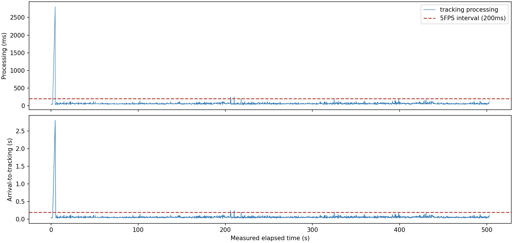
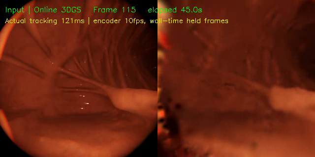
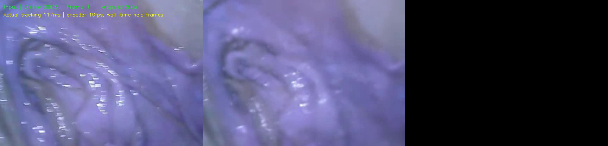

# 展示素材与证据边界

本页汇集已有项目的历史图片、图表与视频。图片均实际查看后选入，按字节原样复制，未裁掉失败部分、未重绘或修改画面。文件来源、时间、大小和 SHA-256 记录在 [media-provenance.json](media-provenance.json)。历史日期为 2026-10-03～05；不能作为 2026-10-06 新 checkout 的验收证据。

## 网站：自由视角与轨迹回放

历史截图展示 TUM office、场景目录、视角控制、轨迹与最终高斯地图。地图可见明显毛刺与模糊；展示可操作性不等于证明几何质量。当前源码提供点击地图后 WASD 移动、空格上升、Shift 下降、鼠标转向、Esc 退出，以及沿轨迹回放、观测累积和 02 / 04 短段对照。

最终高斯地图模式回放相机轨迹，地图本身保持最终状态；RGB-D 观测累积模式才随输入增加观测点。浏览 FPS 是前端渲染速率，不是算法吞吐。02 / 04 为相同 240 帧输入、20 步预算的开发对照，页面记载 PSNR +1.50 dB、SSIM +0.0193；未据此证明完整长序列或跨数据集成功。

## 自然场景：位姿与处理时序

图中灰色是参考轨迹，蓝色是 SE(3) 对齐估计；三组为 TUM office、TUM xyz 和 Replica office0。轨迹重合只支持位姿评价，不能推出真实表面毫米精度。

上图为 tracking processing，下图为 arrival-to-tracking 延迟，红虚线为 5 FPS 输入的 200 ms 间隔。初始化存在约 2.8 s 峰值，不能只看稳定区间概括全程。

仓库 `工程/交互演示/assets/scenes.json` 保存下列历史场景元数据：

| 场景 / 运行标识 | 高斯数量 | 输入节拍 | 记录的跟踪吞吐 | 记录的 ATE |
| --- | ---: | ---: | ---: | ---: |
| TUM office / `srv-demo-officefull-5fps` | 388,401 | 5 FPS | 4.9992 FPS | 0.08508 m |
| Replica office0 / `srv-final-replicaoffice0-5fps-h10` | 1,146,721 | 5 FPS | 4.5012 FPS | 0.002308 m |
| Unity colon / `srv-med-unity240` | 6,059 | 5 FPS | 3.7432 FPS | 未评价 |

这些是已有运行记录，不是新机器 benchmark。Replica 是合成数据；Unity 的深度编码和尺度尚未闭合。高斯数量、输入节拍、跟踪吞吐和 ATE 分别衡量不同内容，不能互相替代。

## 医学探索与失败

Unity 局部地图仍显模糊，深度编码与尺度未闭合。历史视频说明记录实际吞吐约 3.74 FPS；画面编码率不能替代这个测量值。

HighCam 为真实离体小肠的局部诊断，展示关闭恒速预测后的 240 帧片段。1000 帧位姿验收未通过，医学 ATE 未评价，不宣传完整长序列成功或临床准确性。

## 视频入口

| 视频 | 下载 / 播放 | 来源解释 |
| --- | --- | --- |
| TUM 真实室内在线流 | [natural-tum-online.mp4](https://github.com/imsquner/3dgs-reconstruction/releases/download/v0.1.0-assets/natural-tum-online.mp4) | 实际在线关键帧地图 + 按实验日志时钟后期对齐的源输入，60 秒、不加速 |
| Replica 合成室内在线流 | [natural-replica-online.mp4](https://github.com/imsquner/3dgs-reconstruction/releases/download/v0.1.0-assets/natural-replica-online.mp4) | 同样采用实际关键帧地图与日志对齐输入 |
| 最终地图自由浏览 | [natural-map-tour.mp4](https://github.com/imsquner/3dgs-reconstruction/releases/download/v0.1.0-assets/natural-map-tour.mp4) | 最终 Replica PLY 离线渲染；20 FPS 是播放/渲染率 |
| Unity 医学局部 | [medical-unity-local.mp4](https://github.com/imsquner/3dgs-reconstruction/releases/download/v0.1.0-assets/medical-unity-local.mp4) | 30 秒原录像片段，无加速；局部探索 |
| HighCam 局部诊断 | [medical-highcam-diagnostic.mp4](https://github.com/imsquner/3dgs-reconstruction/releases/download/v0.1.0-assets/medical-highcam-diagnostic.mp4) | 30 秒原录像片段，无加速；失败边界如上 |

视频解释核对自源项目 `gpt-6/汇报/成品/演示/播放说明.md`。自然输入是数据集虚拟连续流，尚未接入实际摄像头；自然视频不是原生 live camera / 桌面录屏。医学录像的 10 FPS 是编码率。Release 视频链接不保证在 GitHub Markdown 中内嵌播放。

## 来源与使用

图片为本项目历史实验图和网站截图，包含 TUM RGB-D、Replica、Unity / HighCam 相关场景的派生展示。转载时保留本项目说明及对应上游、数据来源署名，按各自条款使用。项目公开可见并不统一授予所有素材商业使用权。

Replica 地图研究资产与 core 网站资产分开发放；下载研究包需阅读并接受 Replica 条款。TUM 完整原包的数据许可和署名应按仓库许可材料保留。第三方算法代码依 [UPSTREAM](UPSTREAM.md) 的固定来源及独立许可处理。本页没有重新授予上游或医学数据权利。
